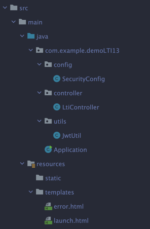

# 🌐 Spring Boot LTI 1.3 Integration with Moodle

## 📘 Introduction

This is a sample **Spring Boot** application showcasing integration with **Moodle** using the **LTI 1.3 (Learning Tools Interoperability)** standard. The application demonstrates a seamless LTI 1.3 launch flow, enabling external tools to interact with Moodle securely.

### Key Features
- **LTI 1.3 Launch Flow**: Initiates a secure launch from Moodle to the tool.
- **JWT Validation**: Validates JSON Web Tokens (JWT) using JSON Web Key Sets (JWKS).
- **LTI Claims Extraction**: Extracts user information, context, and roles from the JWT.
- **Custom Welcome Page**: Redirects to a custom page after successful launch.

## 🛠️ Technologies Used

- **Java 21**
- **Spring Boot**
- **JJWT (io.jsonwebtoken)**: For JWT parsing and validation.
- **LTI 1.3 OpenID Connect**: For secure authentication and launch flow.
- **JWKS (JSON Web Key Set)**: For retrieving public keys to validate JWTs.
- **Moodle 5.0.1**: The target Learning Management System (LMS).

## 📂 Project Structure


Below is the project structure for the application:

```plaintext
src/main/
├── java/com/example/demoLTI13/
│   ├── config/
│   │   └── SecurityConfig.java       # Security configuration (optional)
│   ├── controller/
│   │   └── LtiController.java        # Handles LTI launch and welcome page
│   ├── utils/
│   │   └── JwtUtil.java              # Utility for JWT validation
│   └── Application.java              # Main Spring Boot application class
│
└── resources/
    ├── static/                       # Optional static assets (e.g., CSS, JS)
    └── templates/
        ├── error.html                # Error page for invalid JWTs
        └── launch.html               # Welcome page after successful LTI launch
```

